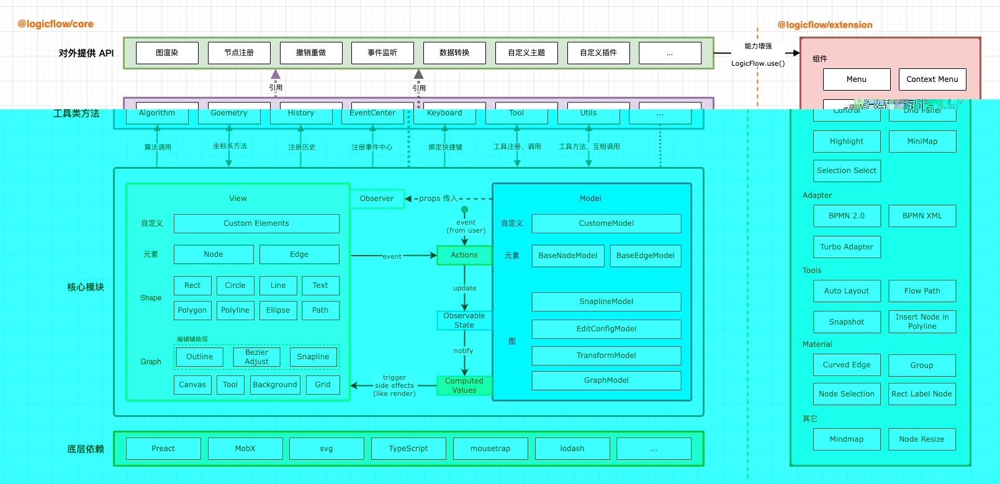

# 节点 Node

LogicFlow 的内置了一些基础节点，开发者在实际应用场景中，可以基于这些基础节点，定义符合自己业务逻辑的节点。

## 认识基础节点

LogicFlow是基于svg做的流程图编辑框架，所以我们的节点和连线都是svg基本形状，对LogicFlow节点样式的修改，也就是对svg基本形状的修改。LogicFlow内部存在7种基础节点，分别为：

1. 矩形 --- [rect](https://developer.mozilla.org/zh-CN/docs/Web/SVG/Element/rect)
1. 圆形 --- [circle](https://developer.mozilla.org/zh-CN/docs/Web/SVG/Element/circle)
1. 椭圆 --- [ellipse](https://developer.mozilla.org/zh-CN/docs/Web/SVG/Element/ellipse)
1. 多边形 - [polygon](https://developer.mozilla.org/zh-CN/docs/Web/SVG/Element/polygon)
1. 菱形 -- `diamond`
1. 文本 --- [text](https://developer.mozilla.org/zh-CN/docs/Web/SVG/Element/text)
1. HTML -- `html`

<code id="node-shapes" src="../../src/tutorial/basic/node/shapes"></code>

LogicFlow的基础节点是比较简单的，但是在业务中对节点外观要求可能有各种情况。LogicFlow提供了非常强大的自定义节点功能，可以支持开发者自定义各种节点。下面是基于继承的自定义节点介绍。

## 自定义节点

LogicFlow是基于继承来实现自定义节点、边。开发者可以继承LogicFlow内置的节点，然后利用面向对象的[重写](https://baike.baidu.com/item/%E9%87%8D%E5%86%99/9355942?fr=aladdin)机制。重写节点样式相关的方法，来达到自定义节点样式的效果。



:::warning{title=注意}
LogicFlow推荐在实际应用场景中，所有的节点都使用自定义节点，将节点的type定义为符合项目业务意义的名称。而不是使用圆形、矩形这种仅表示外观的节点。
:::

### 节点`model`和`view`

在自定义一个节点的时候，我们需要定义节点的`model`和`view`。这是因为LogicFlow基于MVVM模式，需要通过重写定义`model`上获取样式相关的方法和重写`view`上的`getShape`来定义更复杂的节点外观。

这是一个基于内置节点的自定义节点例子👇，节点自定义采用了不同的方式实现😊

<code id="node-custom" src="../../src/tutorial/basic/node/custom"></code>

:::info{title=提示}

LogicFlow为了开发的时候将开发体验和现在前端流行的开发体验对齐，也为了在代码层面更好的理解，让更多的人可以参与进来，我们基于preact、mobx以MVVM模式进行开发。如果大家熟悉react开发的话，可以直接阅读我们的源码，你们可以发现整个项目阅读起来难度和你自己开发的项目差不多。**我们欢迎大家一起参与进来。**

:::

LogicFlow 内部存在 7 种基础节点, 自定义节点的时候可以基于需要选择任意一种来继承, 然后取一个符合自己业务意义的名字。以@logicflow/extension中提供的可缩放节点为例：LogicFlow 基础节点不支持节点缩放，于是 LogicFlow 在extension包中，基于基础节点，封装了对节点缩放的逻辑，然后发布出去。这样开发者可以直接基于extension中的可缩放节点进行自定义。

```jsx | pure
import { RectResize } from "@logicflow/extension";
class CustomNodeModel extends RectResize.model {}
class CustomNode extends RectResize.view {}
```

### 自定义节点`model`

LogicFlow把自定义节点外观分为了`自定义节点样式属性`和`自定义节点形状属性`两种方式。更多详细定义方法，请查看[NodeModelApi](/api/node-model-api)。

1.  #### 样式属性

在LogicFlow中，外观属性表示控制着节点`边框`、`颜色`这类偏外观的属性。这些属性是可以直接通过[主题配置](/api/theme-api)来控制。自定义节点样式可以看做在主题的基础上基于当前节点的类型进行再次定义。

例如：在主题中对所有`rect`节点都定义其边框颜色为红色`stroke: red`，那么可以在自定义节点`UserTask`的时候，重新定义`UserTask`边框为蓝色`stroke: blue`。更细粒度的节点样式控制方法，详情见[API 样式属性](/api/node-model-api#样式属性)。

```jsx | pure
class UserTaskModel extends RectNodeModel {
  getNodeStyle() {
    const style = super.getNodeStyle();
    style.stroke = 'blue';
    return style;
  }
}
```

2. #### 形状属性

在LogicFlow中，形状属性表示节点的宽`width`、高`height`，矩形的圆角`radius`, 圆形的半径`r`, 多边形的顶点`points`等这些控制着节点最终形状的属性。因为LogicFlow在计算节点的锚点、连线的起点终点的时候，会基于形状属性进行计算。对于形状属性的自定义，需要在`setAttributes`方法或`initNodeData`方法中进行。

LogicFlow对于不同的基础节点，存在一些各基础节点自己特有的形状属性。详情见[API 形状属性](TODO)。

```jsx | pure
class customRectModel extends RectNodeModel {
  initNodeData(data) {
    super.initNodeData(data);
    this.width = 200;
    this.height = 80;
  }
  // or
  setAttributes() {
    this.width = 200;
    this.height = 80;
  }
}
```
:::warning{title=注意}

如果不在`model`中设置形状属性，而是直接在`view`中直接定义生成图形的宽高这种形状属性，会出现锚点位置、outline大小不正确的情况。同时，连线的位置也可能会出现错乱。

:::

3. #### 基于properties属性自定义节点样式

在上一节LogicFlow的实例中的`图数据`里提到，不论是节点还是边，LogicFlow都保留了properties字段，用于给开发者存放自己的业务属性。所以在自定义节点样式的时候，可以基于`properties`中的属性来控制节点显示不同的样式。

```jsx | pure
class UserTaskModel extends RectNodeModel {
  getNodeStyle() {
    const style = super.getNodeStyle();
    const properties = this.properties;
    if (properties.statu === 'pass') { // 业务属性statu为‘pass’时展示边框为green
      style.stroke = "green";
    } else if (properties.statu === 'reject') { // 业务属性statu为‘reject’时展示边框为red
      style.stroke = "red";
    } else {
      style.stroke = "rgb(24, 125, 255)";
    }
    return style;
  }
}
```
:::info{title=提示}

如果不了解为什么`this.properties`打印出来是一个Proxy对象, 无法看到属性。请查看[issue](https://github.com/didi/LogicFlow/issues/530)

:::

### 自定义节点`view`

LogicFlow在自定义节点的`model`时,可以定义节点的基础形状、样式等属性。但是当开发者需要一个更加复杂的节点时，可以使用LogicFlow提供的自定义节点`view`的方式。

下面这个例子就是关于节点`view`的设置，多次点击`节点1`试试呢～

<code id="node-custom-view" src="../../src/tutorial/basic/node/custom-view"></code>

这里对于`Shape`的返回用到了`h函数`，`h`方法是LogicFlow对外暴露的渲染函数，其用法与`react`、`vue`的[createElement](https://cn.vuejs.org/v2/guide/render-function.html#createElement-%E5%8F%82%E6%95%B0)一致。但是这里我们需要创建的是`svg`标签，所以需要有一定的svg基础知识。

举几个简单的例子:

```jsx | pure
h(nodeName, attributes, [...children])

// <text x="100" y="100">文本内容</text>
h('text', { x: 100, y: 100 }, ['文本内容'])

/**
 * <g>
 *   <rect x="100" y="100" stroke="#000000" strokeDasharray="3 3"></rect>
 *   <text x="100" y="100">文本内容</text>
 * </g>
 */

h('g',{}, [
  h('rect', { x: 100, y: 100, stroke: "#000000", strokeDasharray="3 3"}),
  h('text', { x: 100, y: 100 }, ['文本内容'])
])
```

#### `getShape`方法

此方法作用就是定义最终渲染的图形, LogicFlow内部会将其返回的内容插入到svg DOM上。开发者不是一定需要重写此方法，只有在期望改变最终渲染图形svg DOM的时候才使用此方法。以上面是例子来说，`rect`节点最终渲染的svg DOM只是一个矩形。但是当我们想要在上面加一个图标的时候，那边必定需要修改到最终渲染图形的svg DOM了，这个时候就需要通过重写`getShape`来实现了。

LogicFlow定义一个节点的外观有三种方式，分别为**主题**、**自定义节点model**、**自定义节点view**。这三种方式优先级为`主题 < 自定义节点model < 自定义节点view`。他们的差异是：
- 主题：定义所有此基础类型节点的通用样式，例如定义所有`rect`节点的边框颜色、宽度等。
- 自定义节点model：定义此注册类型节点的样式。
- 自定义节点view: 定义此注册类型节点svg dom。

:::warning{title=注意}
虽然`自定义节点view`优先级最高，功能也最完善，理论上我们可以完全通过`自定义节点view`实现任何我们想要的效果，但是此方式还是存在一些限制。
1. `自定义节点view`最终生成的图形的形状属性必须和`model`中形状属性的一致，因为节点的锚点、外边框都是基于节点model中的`width`和`height`生成。
2. `自定义节点view`最终生成的图形整体轮廓必须和继承的基础图形一致，不能继承的`rect`而在getShape的时候返回的最终图形轮廓变成了圆形。因为LogicFlow对于节点上的连线调整、锚点生成等会基于基础图形进行计算。
:::

#### 一些思考🤔️

1. ##### 为什么`rect`的`x`,`y`不是直接从`model`中获取的`x`, `y`?

在LogicFlow所有的基础节点中，`model`里面的`x`,`y`都是统一表示中心点。但是`getShape`方法给我们提供直接生成svg dom的方式，在svg中, 对图形位置的控制则存在差异：

- `rect`: 通过`x`, `y`表示图形的位置，但是表示是图形左上角坐标。 所以一般通过中心点，然后减去节点的宽高的一半计算出左上角坐标。

```jsx | pure
const { x, y, width, height, radius } = this.props.model;
// svg dom <rect x="100" y="100" width="100" height="80">
h("rect", {
  ...style,
  x: x - width / 2,
  y: y - height / 2,
  rx: radius, // 注意这里是rx而不是radius
  ry: radius,
  width,
  height
}),
```

- `circle`和`ellipse`: 通过`cx`, `cy`表示图形的位置，含义为中心点的坐标。

```jsx | pure
const { x, y, r } = this.props.model;
// svg dom <circle cx="100", cy="100", r="20">
h("circle", {
  ...style,
  r, // 半径保持不变
  cx: x,
  cy: y,
})

// 椭圆
const { x, y, rx, ry } = this.props.model;
// svg dom <ellipse cx="100", cy="100", rx="20" ry="10">
h("ellipse", {
  ...style,
  cx: x,
  cy: y,
  rx,
  ry
})
```

- `polygon`: 所有的顶点坐标已包含位置

```jsx | pure
const { x, y, points } = this.props.model;
const pointStr = points.map((point) => {
    return `${point[0] + x}, ${point[1] + y}`
  }).join(" ");
// svg dom <polygon points="100,10 250,150 200,110" >
h("polygon", {
  ...style,
  r, // 半径保持不变
  points: pointStr,
})
```

:::info{title=自定义矩形的view时radius设置}
在`model`中，`radius`是矩形节点的形状属性。但是在自定义`view`时需要注意，svg里面设置矩形的圆角并不是用`radius`，而是使用[rx](https://developer.mozilla.org/zh-CN/docs/Web/SVG/Attribute/rx), ry。所以在自定义`view`的矩形时，需要将model中`radius`的赋值给`rx`和`ry`，否则圆角将不生效。
:::

2. ##### props怎么用？

LogicFlow是基于`preact`开发的，我们自定义节点view的时候，可以通过`this.props`获取父组件传递过来的数据。`this.props`对象包含两个属性，分别为:

- `model`: 表示自定义节点的model
- [graphModel](/api/graphModelApi.html): 表示logicflow整个图的model

3. ##### 图标的path如何获取？

一般情况下，图标我们可以找UI或者去[iconfont.cn](https://www.iconfont.cn/)获得一个svg格式的文件。然后再IDE中以文本的方式打开，然后格式化，就可以看到代码。代码中一般是最外层一个svg标签，里面是一个或者多个path。这个时候，我们使用前面提到的`h`方法来实现svg文件中的代码即可。

svg标签一般包括如下属性：
- `viewBox`: [viewBox](https://developer.mozilla.org/zh-CN/docs/Web/SVG/Attribute/viewBox)属性允许指定一个给定的一组图形伸展以适应特定的容器元素。一般把svg标签上的`viewBox`属性值复制过来就行。
- `width`和`height`: 这个不需要使用svg标签上的`width`和`height`, 直接写成你期望的宽高就行。

path标签属性：

- `d`: 该属性定义了一个路径。直接复制svg代码过来即可, 不需要去关系d具体内容表示的含义。
- `fill`: 路径的填充颜色, 一般和节点的边框颜色一致，但是也可以按照业务需求自定义。

本章基础节点就介绍到这里，如果有对节点更多需求请移步至[进阶-节点](TODO)进行查看。